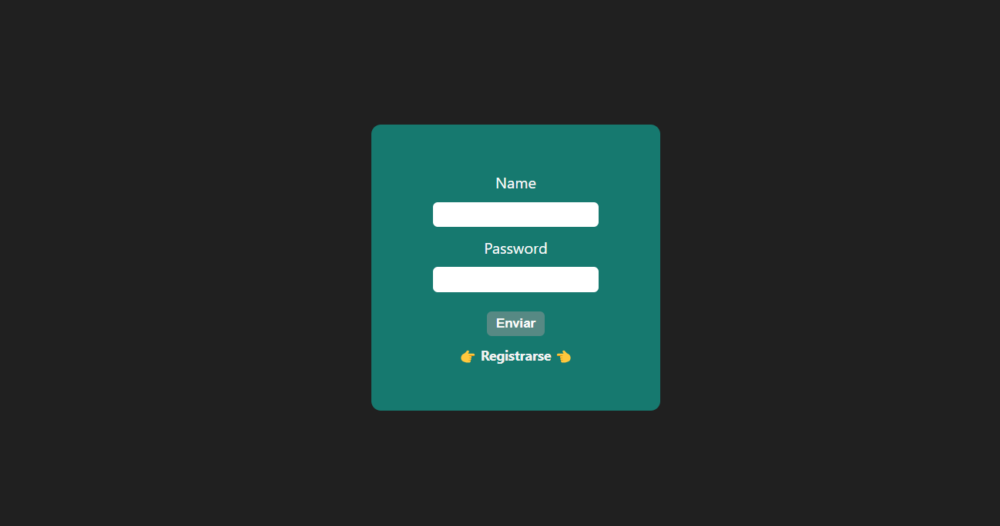
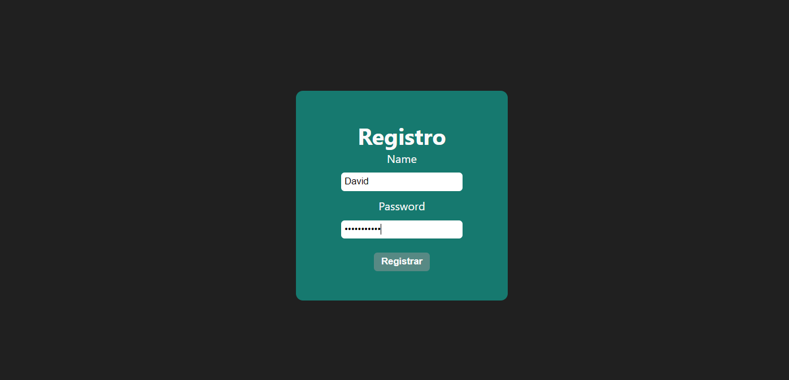
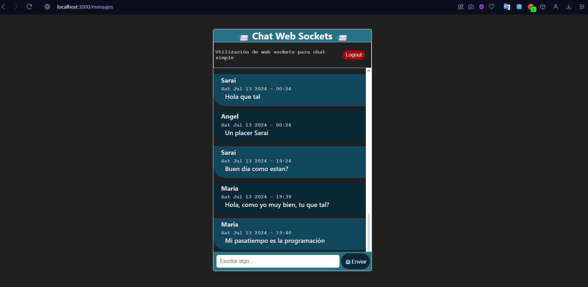
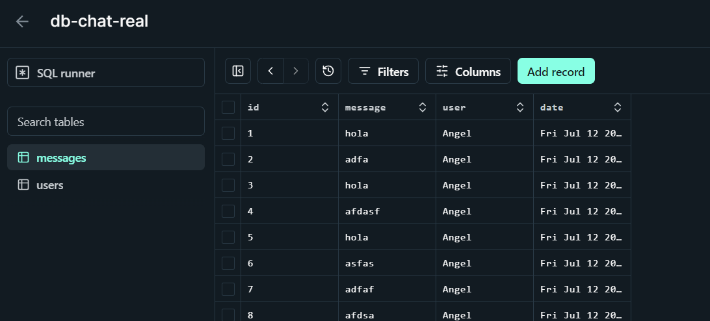

# Chat sencillo usando Web Sockets

Desarrollado por: Angel Torcelli

## Resumen

El presente proyecto se enfoca en crear un chat sencillo utilizando el protocolo WebSocket con el fin de poner en practica está tecnología. Se desarollo una API con NodeJS la cual sirve archivos estáticos para renderizar plantillas HTML.

Las tecnologías utilizadas son:

- NodeJs
- WebSocket (socket.io)
- SQLite (Turso)

## Funcionamiento

Primero es necesario estar registrado para utilizar el chat, de no estarlo es posible registrarse dando click en el botón de registro.

Registro

Al ingresar ya es posible enviar mensajes a todos los usuario conectados.
Para la sesión del usuario se utilizó Json Web Tokens (JWT).

La base de datos es bastante simple, se utilizó la plataforma Turso que nos permite tener DB SQLite en la nube. La DB consta de dos tablas, una para usuarios y otra donde se almacenan los mensajes.

Cada mensaje guarda el nombre del usuario, el mensaje y la fecha. La tabla de usuarios unicamente guarda el nombre y la contraseña del usuario.
